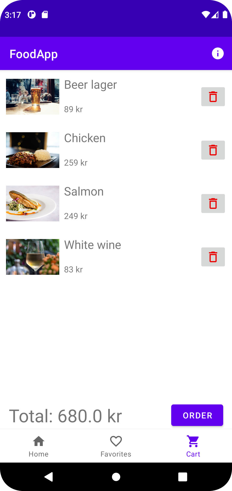
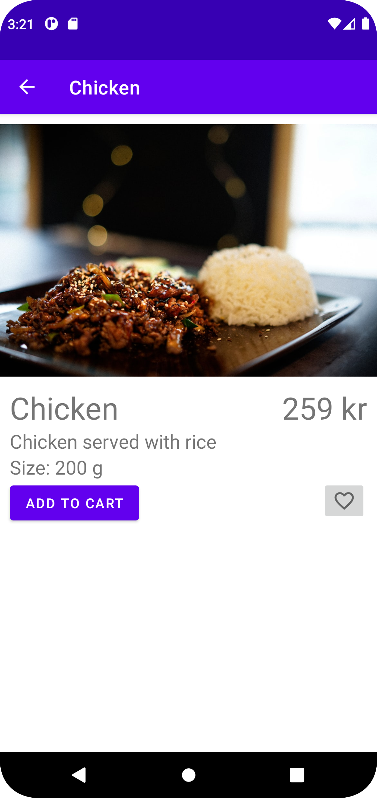
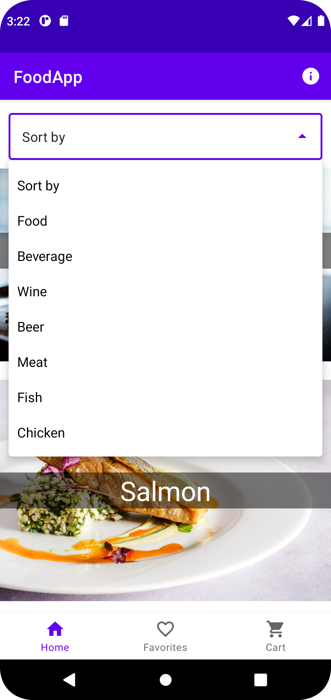
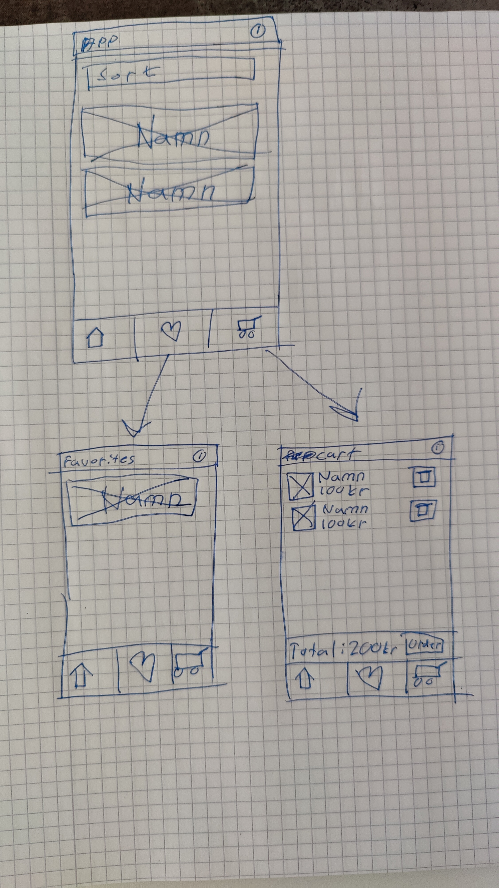

# Rapport

Skapade en app för att beställa mat och dryck. I appen använde jag mig av fragments för att skapa huvudlayout, dvs ett fragment för varje tab. Ett Homefragment, favoritesfragment och cartfragment.
Favorites och cart bygger på mer eller mindre samma grund, båda använde sig av en databas för att spara det användaren har lagt till. Skillnade är vad som visas i fragmentet.

#### Hämta data från databas
För att skapa en varukorg så användes den lokala databasen för att lagra varorna. Nedanstående kodstycke är metoden som hämtar alla
varorna. Då data bara ska läsas från databasen här och inget ska skrivas används det en readable anslutning till databasen.
Datan som hämtas stegas igenom och för varje rad skapas det ett nytt food objekt som sedan läggs till i en lista som slutligen returneras
för att användas i appen. I screenshot 1 syns resultatet av metoden som hämtade varorna som var tillagda.

````
public List<Food> getAll() {
        SQLiteDatabase db = getReadableDatabase();

        Cursor cursor = db.query(DatabaseTables.CART.TABLE_NAME, null, null, null, null, null, null);
        List<Food> favorites = new ArrayList<>();

        while (cursor.moveToNext()) {
            Auxdata auxdata = new Auxdata(
                    cursor.getString(cursor.getColumnIndexOrThrow(DatabaseTables.CART.COLUMN_NAME_DESCRIPTION)),
                    cursor.getString(cursor.getColumnIndexOrThrow(DatabaseTables.CART.COLUMN_NAME_IMG)),
                    cursor.getString(cursor.getColumnIndexOrThrow(DatabaseTables.CART.COLUMN_NAME_TYPE))
            );

            Food food = new Food(
                    cursor.getString(cursor.getColumnIndexOrThrow(DatabaseTables.CART.COLUMN_NAME_ID)),
                    cursor.getString(cursor.getColumnIndexOrThrow(DatabaseTables.CART.COLUMN_NAME_NAME)),
                    cursor.getInt(cursor.getColumnIndexOrThrow(DatabaseTables.CART.COLUMN_NAME_SIZE)),
                    cursor.getInt(cursor.getColumnIndexOrThrow(DatabaseTables.CART.COLUMN_NAME_COST)),
                    cursor.getString(cursor.getColumnIndexOrThrow(DatabaseTables.CART.COLUMN_NAME_CATEGORY)),
                    auxdata,
                    cursor.getLong(cursor.getColumnIndexOrThrow(DatabaseTables.CART.COLUMN_NAME_DB_ID))
            );
            favorites.add(food);
        }
        cursor.close();
        return favorites;
    }
````



#### Json
Nedanstående är ett exempel på json-data som användes. De färdiga attributen stämde ganska bra med de som krävdes för den data jag ville ha.
Jag var tvungen att lägga till lite extra data i auxdata för att få med en lite längre beskrivning av produkten, en länk till en bild samt vilken typ produkten var.

````
{
	"ID": "b21albda_chicken",
	"name": "Chicken",
	"type": "b21albda",
	"company": "",
	"location": "",
	"category": "Food",
	"size": 200,
	"cost": 259,
	"auxdata": {
		"description": "Chicken served with rice",
		"img": "https://images.unsplash.com/photo-1615750824528-4398b8e5cd93?crop=entropy&cs=tinysrgb&fm=jpg&ixlib=rb-1.2.1&q=80&raw_url=true&ixid=MnwxMjA3fDB8MHxwaG90by1wYWdlfHx8fGVufDB8fHx8&auto=format&fit=crop&w=1171&q=80",
		"type": "Chicken"
	}
}
````



#### Detaljvyn
För att få upp en detaljvy behövdes två saker göras, dels var man tvungen att kunna klicka på det item som man ville se samt att datan om det itemet var tvunget att skickas med till den nya aktiviteten.
För att lösa så att man kunde klicka på ett item skapade jag ett interface med en metod `onItemClicked` som MainActivity sedan implementerade. När adaptern sedan skapar en viewholder satte jag en listener på hela viewholder.
När ett item blir klickat på anropas `onItemClicked()`.

Nedanstående kodstycke visar implementationen av `onItemClicked()`. Metoden tar in ett food item vilket är det item som blev klickat på. En intent skapas till detalj aktiviteten och itemet skickas med som en extra.
För att kunna skicka med ett objekt var jag tvungen att använda interfacet `Parcelable` på klasserna `Food` och `Auxdata`. Det `Parcelable` gör är att ett objekt kan konverteras till en sträng och tillbaka vilket var användbart då extra skickas som strängar.

(Exempel på detaljvyn visades i föregående bild)

````
@Override
public void onItemClicked(Food food) {
    Intent intent = new Intent(this.getContext(), DetailActivity.class);
    intent.putExtra("food", food);
    startActivity(intent);
}
````

#### Filtrera data
Kodstycket är metoden för att sortera datan. Metoden tar in en sträng på vad den ska sortera. Strängen hämtas från en dropdown meny på startsidan. Då sorteringen ska sparas när appen avslutas använde jag mig av shared preferences.
Metoden börjar med att spara hur datan ska sorteras i shared preferences under nyckeln `type`. För att sortera datan väljer jag att skapa en ny lista som innehåller alla items som passar in på sorteringen.
Skulle den inskickade sorteringstypen vara "Sort by" så ska all data visas och då sätts den sorterade listan till listan som skapades baserad på den data som hämtades från API:t.
Är sorteringen inte default värdet så finns det ett värde som ska sorteras, då loopas listan med alla items igenom och de som matchar sorteringen läggs in i den sorterade listan som slutligen skickas till adapter så som uppdaterar recyclerviewn.

````
private void sortBy(String sort) {
    SharedPreferences.Editor editor = pref.edit();

    editor.putString("type", sort);
    editor.apply();

    List<Food> sorted = new ArrayList<>();
    if (sort.equals("Sort by")){
        sorted = foods;
    } else {
        for (Food food : foods) {
            if (food.getCategory().equals(sort) || food.getAuxdata().getType().equals(sort))
                sorted.add(food);
        }
    }

    adapter.setFoods(sorted);
    adapter.notifyDataSetChanged();
}
````





#### Skiss
